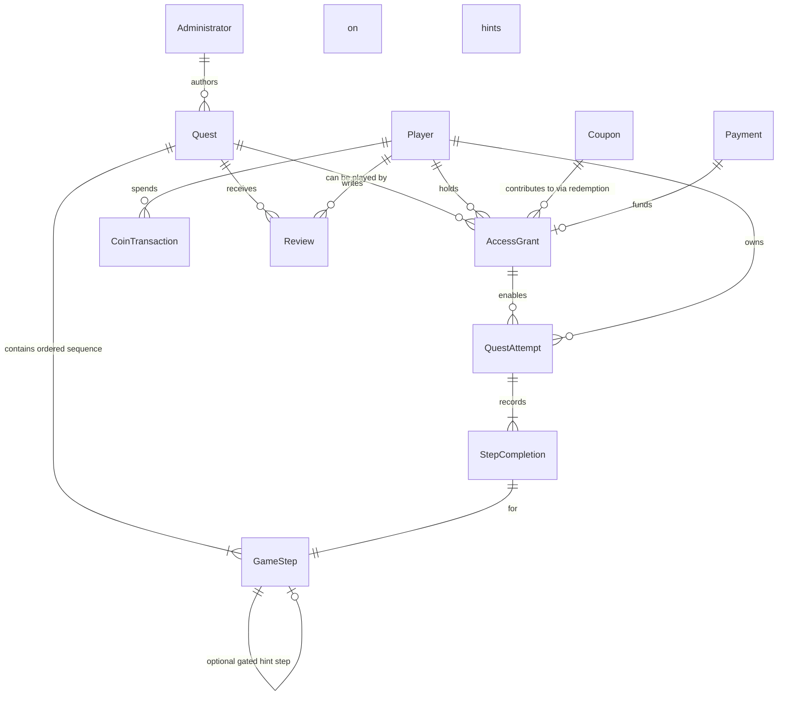

# Domain Model and Conceptual Schema (Business Concept v0.1)

**Purpose:** Define the core business entities, aggregates, relationships, and invariants at a technology-agnostic level. This is the single source of truth for what the system *is* before any implementation or tech stack decisions.

## Bounded Contexts (High Level)

1. **Quest Content** — Authoring and definition of quests and their steps. Owned by Administrators.
2. **Player Access & Commerce** — Purchases, coupons, grants, free quests. Produces the right to play.
3. **Play & Progress** — Attempts, step completions, offline bundles, coin spending for hints, reviews. Must support disconnected operation.
4. **Catalog & Discovery** (thin) — Public view of published quests for players.
5. **Identity** (minimal) — Players and Administrators. No external authors.

We deliberately keep contexts few and boundaries crisp. The old 47-type sprawl is rejected.

## Core Aggregates and Entities

### Quest (Aggregate Root)

- Identity, titles, summary, preview image (Russian only for v1).
- Base price (RUB, nullable/0 for free quests).
- Status: Draft / Published / Archived (or similar).
- Difficulty level (Низкая / Средняя / Высокая) — display + filtering only.
- Age guidance (for all / children / adults) — informational.
- City / tags — simple categorization.
- Geo start point (for display / map centering).
- Statistics (denormalized for read): completed count, average rating, etc.
- **Contains ordered sequence of GameSteps** (the heart of the product).

Invariants:
- A published quest must have at least one step.
- Steps have a stable order/position for a given quest version.
- Changing content of a published quest should not retroactively break players who already downloaded an older snapshot (versioning at download time matters).

### GameStep (Entity, part of Quest aggregate)

The fundamental unit. Refined from adversarial analysis (ANALYZE-03 + cross-slices): rich content is primary differentiator (atmosphere, immersion); completion semantics are small attached data (not 14 overloaded types or flag sprawl); supporting behaviors are composable without invalid combos.

Attributes (conceptual):
- Position / order within quest (integer or sortable key; supports reordering in constructor).
- Rich content blocks (RU for v1): title/internal name, main_text/task description, place_text, button variants, question prompt (if applicable), durations, author notes (constructor-only).
- Media: primary image(s), hint_image (coin-gated), video_ref (10-30s typical).
- Optional geo {lat, lng} — **display only** for v1 (map pin; "show on map" for purchased hints).
- Completion semantics (small discriminated data, versioned in snapshots):
  - `completion: { mode: 'physical' | 'answer'; acceptable?: string[]; allow_note?: boolean }`
    - 'physical': explicit player confirmation (uniform "I did it / Found it / Completed the action" + optional short note). No `acceptable`. Trust player honesty. (Locked "no difference" across physicals; rich surrounding content provides differentiation.)
    - 'answer': player submits value; client matches against `acceptable` list (multiline input in constructor; simple membership initially, normalization later). 
- Supporting / additive behaviors (validated composable object or small array; can attach to any completion):
  - `gift?: { coins: number; narrative_text: string }` (award on completion of this step or terminal).
  - `hint?: { cost_coins: number; reveal_text?: string; reveal_geo?: boolean }` (per-step Buy_hint equivalent).
  - `media_video?: { ref: MediaRef }`
  - `terminal?: { show_review_prompt: boolean }`
  - `narrative_advance?: boolean` (pure continue; no completion required beyond advance).
- Snapshot version id (baked at publish for this step's content + rules + supporting amounts).

Invariants (updated post-analysis):
- Exactly one primary completion mode per step (physical confirmation or answer list).
- Supporting behaviors are additive and validated at authoring (no "physical + answer list" nonsense).
- All data (including acceptable list, gift coins, hint cost) is frozen in the quest snapshot at publish time. Old attempts use the rules/amounts from *their* version.
- Rich content (unique descriptions, custom button text, images, "feel the cold metal") is the primary carrier of quest atmosphere and step differentiation — not the completion mode or flags.
- Linear ordered sequence (no branching v1).

**Note on old data:** The original `page_constructor` (36 fields, many suffixed languages, self-referential Next_page/Hint, Answer list, Page_type option set with 14+ values) is the raw material. We must ruthlessly simplify to the two task types described + supporting narrative/media/gift steps. Duplication and "constructor" types are cut.

### QuestAttempt (Aggregate Root — per Player + Quest)

Represents one playthrough (supports replay).

- Links: Player, Quest (plus the snapshot version of the quest content at start time).
- Status: InProgress / Completed / Abandoned.
- Started at, last activity, completed at.
- Current / last step position (or explicit pointer to last completed step).
- Total coins spent on hints during this attempt.
- Wrong answer count (aggregate or per step).

A player can have multiple QuestAttempts for the same Quest (replay allowed).

### StepCompletion (Entity)

Records what the player did for a specific step within a specific attempt.

- Links to QuestAttempt + GameStep (or step position + snapshot id).
- For answer steps: the value the player submitted (text, number, etc.).
- For physical steps: simple "confirmed" flag + optional player note or timestamp.
- Client timestamp of completion (for offline).
- Server authoritative `is_correct` (for answer steps) and `verified_at`.
- Coins spent on hint for this step (if any).
- Whether the hint was revealed.

For offline play, completions are created locally first, then synced.

### AccessGrant (Entity)

The "ticket" that allows a player to start or continue attempts on a quest.

- Player + Quest.
- Granted at (purchase, coupon, free, admin grant).
- Source: Payment, CouponRedemption, FreeQuest, Admin.
- Lifetime (no expiry for v1).

A player needs an AccessGrant (or the quest is free) before they can create an Attempt or download the playable bundle.

### Coupon (Entity)

- Code (unique, case-insensitive?).
- Discount type: Percent (e.g. 10%, 25%, 50%, 100% for free via coupon).
- Scope: global or specific quests.
- Usage limits: total uses, per-user uses (usually 1).
- Validity window.
- Created/used by admins.

On successful application during purchase → reduces the charged amount and records a redemption that can produce or contribute to an AccessGrant.

### Player / User (minimal)

- Identity for play and purchases.
- In-game coin balance (separate from real money).
- Profile info needed for play (display name? avatar from Telegram if used?).
- List of AccessGrants (denormalized or queryable).
- List of current/recent Attempts.

**Deliberately minimal.** Old User had 30 fields of mixed auth, geo tracking lists, UI booleans, and lists of everything. We cut all of that.

### Payment / Transaction (supporting)

- External provider reference (YooKassa id, status, amount, etc.).
- Links to the AccessGrant it funded.
- Webhook processing must be idempotent.

### Review (thin, post-completion)

- Player + Quest + Attempt.
- Grade (1-5?), optional text.
- Published flag (admin moderation? or auto).

## Conceptual Relationships (Business ER — not DB schema)

## Critical Business Invariants (v0.2 — updated with offline decisions)

1. A player may only create or advance an Attempt for a Quest if they hold a valid AccessGrant for it (or the quest is free and grant is implicit).
2. Each QuestAttempt (or more precisely each download that starts attempts) is bound to a specific quest version/snapshot. All validation of answers during that attempt uses only the acceptable answers present in that snapshot.
3. The client performs validation against its local snapshot. The server records the submitted values and the validation result from that snapshot; it does not override correctness for attempts on old versions.
4. When a player starts a new attempt (or downloads for a new attempt), they receive the latest published quest version at that time.
5. Multiple attempts are independent. Resetting progress affects only the selected attempt.
6. Coin spend for hints is per-attempt, per-step. Coins are earned via quest completions and gifts defined in steps. Admins do not manually adjust balances (v1).
7. Free quests and 100% coupons produce AccessGrants with the same semantics as paid purchases.
8. All monetary and grant-creating operations must be idempotent with respect to external payment provider events.

## What We Explicitly Reject from Old Model

- 47 data types → target ~12-15 core business concepts.
- Language suffix explosion (`*_RU`, `*_ENG`, `*_SRB` on almost every text field).
- `page` / `page_constructor` and `quest` / `quest_name_constructor` duplication.
- UI state pollution on the User record.
- Event_* table explosion.
- Hundreds of imperative "SetCustomState + Show/Hide" as domain concepts.

## Open Modeling Questions (to be resolved before implementation)

- Exact representation of "acceptable answers" for Question steps (exact match? normalized? multiple correct? regex? puzzle-specific?).
- How much of the old Page_type variety (style, greetings, screenafterquest, etc.) maps cleanly to the two task types + narrative/media/gift/terminal.
- Versioning granularity for quest snapshots (whole quest version, or per-step?).
- Whether "continue" across attempts or devices requires merging state or just picking the latest local attempt on sync.

These will be attacked in subsequent iterations and the Offline + Content docs.
