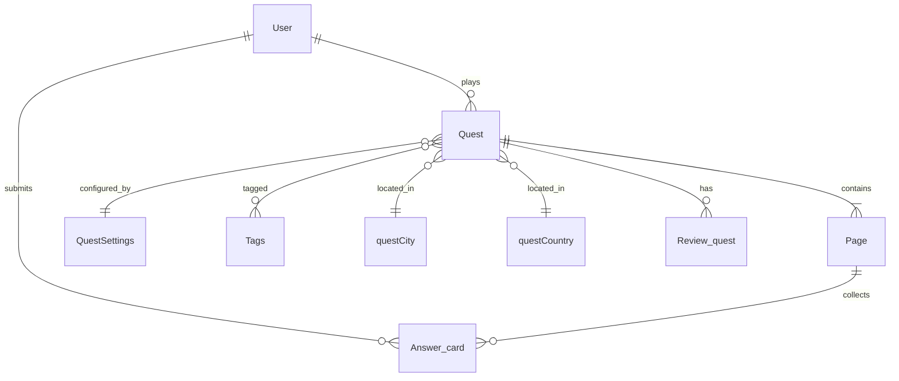

# Data Model

> Full field definitions: `discovery/parsed/data_types.json`

## Entity relationship (core quest domain)

## All data types (47)

| ID | Display name | Fields | API access | Record count |
|----|-------------|--------|------------|--------------|
| `event` | Event | 18 | ❌ schema only | — |
| `page` | Page | 4 | ✅ API | 556 |
| `city` | City | 2 | ❌ schema only | — |
| `tags` | Tags | 1 | ❌ schema only | — |
| `user` | User | 30 | ✅ API | 929 |
| `theme` | Theme | 5 | ❌ schema only | — |
| `coupon` | Coupon | 8 | ❌ schema only | — |
| `no_buy` | No_buy_a_quest | 2 | ✅ API | 0 |
| `record` | Record | 2 | ❌ schema only | — |
| `country` | Country | 2 | ❌ schema only | — |
| `payment` | Payment | 5 | ❌ schema only | — |
| `workday` | Workday | 2 | ❌ schema only | — |
| `deleteid` | deleteId | 1 | ❌ schema only | — |
| `faq_item` | Event_FAQ_item | 3 | ❌ schema only | — |
| `settings` | Settings | 4 | ❌ schema only | — |
| `advantage` | Advantage | 4 | ❌ schema only | — |
| `leafy_map` | Leafy_map | 3 | ❌ schema only | — |
| `questcity` | questCity | 3 | ❌ schema only | — |
| `questname` | QuestName | 0 | ❌ schema only | — |
| `statistic` | Statistic | 9 | ❌ schema only | — |
| `basket_buy` | Basket_buy | 2 | ❌ schema only | — |
| `bug_report` | Bug_report | 4 | ❌ schema only | — |
| `buy_a_qest` | Subscription | 5 | ❌ schema only | — |
| `event_city` | Event_city | 3 | ❌ schema only | — |
| `event_type` | Event_type | 2 | ❌ schema only | — |
| `savegoogle` | SaveGoogle | 1 | ❌ schema only | — |
| `answer_card` | Answer_card | 9 | ❌ schema only | — |
| `event_price` | Event_price | 3 | ❌ schema only | — |
| `twoquestion` | twoQuestion | 1 | ❌ schema only | — |
| `upload_file` | Upload_File | 1 | ✅ API | 2 |
| `fourquestion` | FourQuestion | 1 | ❌ schema only | — |
| `questcountry` | questCountry | 3 | ❌ schema only | — |
| `review_event` | Review_event | 4 | ❌ schema only | — |
| `review_quest` | Review_quest | 4 | ❌ schema only | — |
| `event_country` | Event_country | 3 | ❌ schema only | — |
| `numberofusers` | NumberOfUsers | 1 | ❌ schema only | — |
| `questsettings` | QuestSettings | 7 | ❌ schema only | — |
| `threequestion` | ThreeQuestion | 1 | ❌ schema only | — |
| `event_programm` | Event_program_item | 4 | ❌ schema only | — |
| `event_parameter` | Event_parameter | 2 | ❌ schema only | — |
| `event_work_time` | Event_worktime_item | 4 | ❌ schema only | — |
| `page_constructor` | Page | 36 | ✅ API | 556 |
| `sample_constructor` | Sample_constructor | 6 | ❌ schema only | — |
| `event_meeting_point` | Event_meeting_point | 4 | ❌ schema only | — |
| `question_and_answer` | Event_question_and_answer | 2 | ❌ schema only | — |
| `event_included_in_cost` | Event_included_in_cost | 3 | ❌ schema only | — |
| `quest_name_constructor` | Quest | 31 | ✅ API | 21 |

## Key type details

### Quest (`quest_name_constructor` / API: `quest`)

Core product entity. Fields include: Page list, Quest_setting, Price, Preview_image, Users, Reviews, Tags, geo coordinates (placeStartLatitude/Longitude), statusQuest, reviewGrade, questCity, questCountry.

**API records (test):** 21

### Page / Page constructor (`page` / `page_constructor`)

Quest step content. Fields: Image, Text, Answers, Page_type, multilingual text fields (Main_text_RU/ENG/SRB, Button_text_*, Page_name_RU), Quest_name reference.

**API records (test):** 556 (page and page_constructor return same dataset)

### User (`user`)

Fields: username, Role, Edit_language, Previe_language, authentication object, user_signed_up.

**API records (test):** 929

### Event (`event`)

Tour/calendar events with: Name, Duration, Description, seats, Workday, photos, city/country/type, pricing, program, work times, meeting point, FAQ, Q&A.

**API:** Not enabled — schema from `.bubble` file only.

### Subscription (`buy_a_qest`)

Quest purchase/subscription records.

### Payment (`payment`)

Payment transaction log (linked to YooKassa flow).

## Option sets (enums)

### Role ( Translation_en ) (`role`)
- `admin` — Admin
- `author` — Author
- `client` — Client

### test (`test`)
- `1_` — 1
- `2_` — 2

### Gif_Gift (`gif_gift`)
- `1_` — 1
- `2_` — 2

### Language (`language`)
- `_______` — ru_ru
- `english` — en_us
- `serbian` — sr_sp

### Age_limit (`age_limit`)
- `for_all` — For all
- `for_children` — For children
- `for_adults` — For adults

### Page_type (`page_type`)
- `style` — Style
- `hint` — Hint
- `lead` — Continue
- `gift` — Gift
- `error` — Error
- `start` — Start
- `video` — Video
- `question` — Question
- `greetings` — Greetings
- `question0` — Question
- `namerequest` — NameRequest
- `congratulations` — Congratulations
- `questionnoanswer` — QuestionNoAnswer
- `screenafterquest` — ScreenAfterQuest

### Quest_name (`quest_name`)

### Quest_level (`quest_level`)
- `______` — Низкая
- `_______` — Средняя
- `_______0` — Высокая

### status_quest (`status_quest`)
- `published` — Published
- `test` — Test
- `project` — Project

### Quest_settings (`quest_settings`)
- `name` — Name

### Event_payment_method (`event_payment_method`)
- `cash_upon_meeting` — Cash_upon_meeting
- `donations` — Donations
- `for_free` — For_free

### Event_work_time_status (`event_work_time_status`)
- `full` — Full
- `empty` — Empty
- `middle` — Middle

