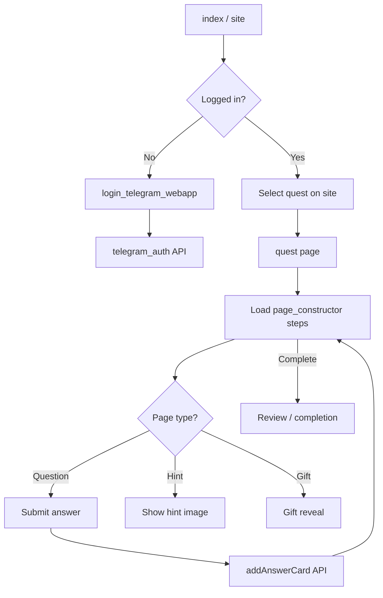
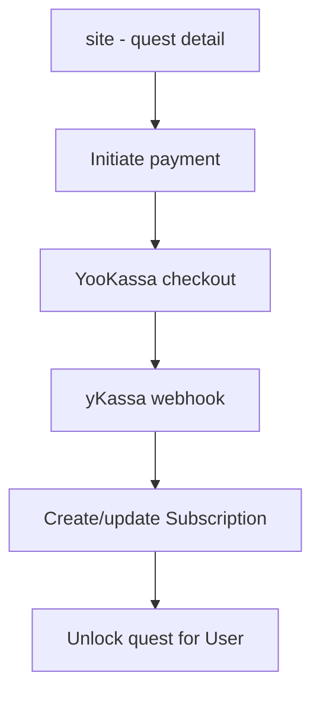

# Pages & User Journeys

## Pages

| Page | ID | Workflows | Elements | Next.js route (proposed) |
|------|----|-----------|----------|-------------------------|
| `reset_pw` | `AAW` | 3 | 2 | /reset_pw |
| `404` | `AAX` | 0 | 2 | /404 |
| `index` | `bTGbC` | 71 | 13 | / |
| `calendar` | `bTKpb` | 116 | 5 | /calendar |
| `site` | `bTLwP` | 183 | 7 | /site |
| `test` | `bTRkd` | 12 | 2 | /test |
| `login_telegram_webapp` | `bTVBs` | 2 | 1 | /login_telegram_webapp |
| `admin` | `bTGqg0` | 9 | 20 | /admin |
| `quest` | `bTKMS0` | 82 | 17 | /quest |
| `delete_user` | `bTUJd0` | 0 | 1 | /delete_user |

## Reusable components (element definitions)

| Name | Type | Group type | Workflows |
|------|------|------------|-----------|
| Image | CustomDefinition | `custom.page_constructor` | 2 |
| Slide_Hint | CustomDefinition | `custom.page_constructor` | 3 |
| Slide_Error | CustomDefinition | `custom.page_constructor` | 21 |
| Quest_Settings | CustomDefinition | `custom.quest_name_constructor` | 16 |
| Main | CustomDefinition | `custom.quest_name_constructor` | 23 |
| Header | CustomDefinition | `custom.quest_name_constructor` | 19 |
| Statistic | CustomDefinition | `custom.quest_name_constructor` | 3 |
| Edit_Page | CustomDefinition | `custom.quest_name_constructor` | 55 |
| New_Quest | CustomDefinition | `custom.quest_name_constructor` | 4 |
| Existing_Quest | CustomDefinition | `custom.quest_name_constructor` | 63 |
| Log In | CustomDefinition | `None` | 5 |
| Upload_File_Previe | CustomDefinition | `custom.upload_file` | 2 |
| Shop_header | CustomDefinition | `None` | 22 |
| Shop_contacts | CustomDefinition | `None` | 4 |
| Rules_of_the_game | CustomDefinition | `custom.page_constructor` | 1 |
| Crop_element | CustomDefinition | `custom.quest_name_constructor` | 15 |
| New_statistic | CustomDefinition | `custom.quest_name_constructor` | 23 |
| Site_log_in | CustomDefinition | `None` | 48 |
| Comments | CustomDefinition | `custom.quest_name_constructor` | 12 |
| Shop_Player_Rating | CustomDefinition | `None` | 2 |
| addLocationAdmin | CustomDefinition | `None` | 5 |
| Coupon | CustomDefinition | `None` | 22 |
| rules | CustomDefinition | `None` | 1 |
| Shop_FAQ | CustomDefinition | `None` | 1 |
| Admin_FAQ | CustomDefinition | `None` | 9 |
| Admin_advantages | CustomDefinition | `None` | 8 |
| Slide_give_prize | CustomDefinition | `custom.page_constructor` | 8 |
| focus_rg_main | CustomDefinition | `custom.quest_name_constructor` | 4 |
| mapbox | CustomDefinition | `custom.page_constructor` | 11 |
| Slide_Start | CustomDefinition | `custom.page_constructor` | 3 |
| ... | | | |

## Critical user journey: Play a quest

## Critical user journey: Buy a quest

