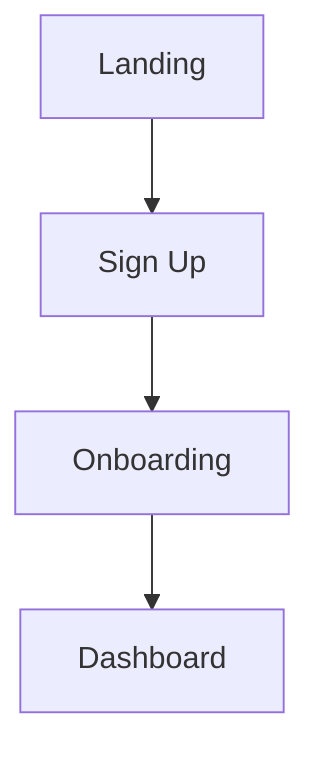

# Bubble.io Project Documentation — AI Agent Task Specification

> **Mission:** Produce a complete, migration-ready specification of a Bubble.io application by extracting every artifact that is reachable via official APIs, supplemented by manual exports where APIs do not exist. The output will feed a rebuild on **Rust (backend) + Next.js (frontend)**.

---

## 0. Agent Operating Principles

You are a **documentation and discovery agent**, not a migration implementer. Your job is to **observe, record, and structure** — never to modify production data or deploy changes unless explicitly authorized for a sandbox environment.

### Non-negotiable rules

1. **Read-only by default.** Use only `GET` requests against the Data API unless the user explicitly authorizes write probes in a dev/sandbox app.
2. **Never commit secrets.** API keys, bearer tokens, and `.bubble` files go in `.env` / `.gitignore` — never in documentation output or git.
3. **Source everything.** Every fact in the final docs must cite its origin: API response, `.bubble` file path, editor screenshot path, or manual note from the user.
4. **Distinguish facts from inferences.** Label anything deduced (e.g. "this workflow likely sends a welcome email") as `INFERRED` vs `CONFIRMED`.
5. **Idempotent runs.** Scripts must be re-runnable; use checkpoints and append-only logs.
6. **Stop and ask** when credentials, app URL, or environment (live vs dev) are ambiguous.

### Deliverable quality bar

The final documentation must allow a **developer who has never seen the Bubble editor** to:
- Recreate the **data model** in PostgreSQL
- Understand **every user-facing flow** end-to-end
- Map **backend processes** to Rust service boundaries
- Identify **integrations**, **scheduled jobs**, and **privacy/security rules**
- Estimate migration scope per page and per workflow

---

## 1. Inputs Required From the User (Block Until Received)

Collect and record these before any API calls:

| Input | Required | Notes |
|-------|----------|-------|
| App name / base URL | Yes | e.g. `https://myapp.bubbleapps.io` or custom domain |
| Environment | Yes | `live` or `dev` (test) branch |
| Admin API token | Yes | Settings → API → Generate new API token |
| Data API enabled types list | Yes | Settings → API → Data API — which types are exposed |
| Workflow API enabled | Yes | Settings → API → "Enable Workflow API and backend workflows" |
| List of public API workflow names | Yes | Backend workflows page — only **exposed** workflows are callable |
| `.bubble` file download | Strongly recommended | Settings → General → "Export application" (paid plan) |
| App editor access | Optional | For gaps API cannot fill |
| Business glossary | Optional | Domain terms the team uses |

Store in `discovery/config/app.env.example` (template) and `discovery/config/app.env` (real, gitignored).

---

## 2. Repository Layout (Create on First Run)

```
discovery/
├── config/
│   ├── app.env.example
│   └── app.env                    # gitignored
├── raw/                           # immutable API responses
│   ├── data-api/
│   │   └── {typename}/
│   │       ├── sample_record.json
│   │       ├── list_page_{cursor}.json
│   │       └── schema_inferred.json
│   ├── workflow-api/
│   │   └── {workflow_name}/
│   │       ├── probe_get.json
│   │       └── probe_post_options.json
│   └── exports/
│       ├── bubble_file/           # extracted .bubble JSON
│       └── csv_json_exports/      # manual Data → Export files
├── parsed/
│   ├── data_types.json
│   ├── field_catalog.json
│   ├── relationships.graph.json
│   ├── pages_index.json
│   ├── workflows_index.json
│   ├── api_workflows_index.json
│   ├── privacy_rules.json
│   ├── option_sets.json
│   ├── plugins.json
│   └── styles_theme.json
├── scripts/
│   ├── fetch_data_types.sh
│   ├── paginate_type.py
│   ├── probe_workflows.sh
│   └── parse_bubble_file.py
├── logs/
│   └── discovery_{timestamp}.log
└── checkpoints/
    └── progress.json

docs/
├── 00_EXECUTIVE_SUMMARY.md
├── 01_APPLICATION_OVERVIEW.md
├── 02_DATA_MODEL.md
├── 03_DATA_MANAGEMENT.md
├── 04_API_SURFACE.md
├── 05_WORKFLOWS_AND_BUSINESS_LOGIC.md
├── 06_PAGES_AND_USER_JOURNEYS.md
├── 07_INTEGRATIONS.md
├── 08_SECURITY_AND_PRIVACY.md
├── 09_BACKGROUND_JOBS_AND_SCHEDULING.md
├── 10_MIGRATION_MAPPING.md
└── APPENDIX/
    ├── GLOSSARY.md
    ├── OPEN_QUESTIONS.md
    └── RAW_INDEX.md
```

---

## 3. What Can vs Cannot Be Grabbed via API

### ✅ Via Bubble Data API (`/api/1.1/obj/`)

- All records for each **enabled** data type (paginated)
- Field names and runtime types (inferred from records)
- Record counts (via pagination `remaining` field)
- Single record by ID
- Constraints / search behavior (via query params)

### ✅ Via Bubble Workflow API (`/api/1.1/wf/`)

- **Execution** of exposed API workflows (use only safe, read-only workflows or OPTIONS probes)
- Response schemas returned by workflows that expose data
- Workflow parameter contracts (from docs + probe calls)

### ⚠️ Via Manual `.bubble` File Export (NOT an API — user must download)

This is the **richest source** for non-data artifacts. Parse it for:

- Page definitions and element trees
- Frontend workflow events and actions
- Backend workflow definitions (full action chains)
- Data type schemas (field types, defaults, delete rules)
- Option sets (enums)
- Privacy rules (conditions + permissions)
- API Connector definitions
- Plugin configuration
- Styles, fonts, responsive breakpoints
- Reusable elements / components
- App settings (SEO, domains, API config)

### ❌ Not available via any public API

- Visual design fidelity (exact CSS — must approximate from styles in `.bubble`)
- Undeployed dev-only changes on live branch
- User password hashes
- Full workflow list unless parsed from `.bubble` (Workflow API only runs exposed endpoints)
- Bubble editor metadata / version history

**Agent instruction:** If `.bubble` file is missing, document all gaps in `docs/APPENDIX/OPEN_QUESTIONS.md` and request it from the user before claiming completeness.

---

## 4. Execution Phases

### Phase A — Environment & API Inventory

**Goal:** Confirm what is reachable and log baseline config.

#### A.1 Verify connectivity

```http
GET {BASE_URL}/api/1.1/obj/user?limit=1
Authorization: Bearer {ADMIN_TOKEN}
```

Record: status code, rate-limit headers, response shape.

#### A.2 Document API configuration

From user-provided editor screenshots OR `.bubble` file `settings` section, record:

- Data API: which types are enabled (Find, Create, Modify, Delete permissions)
- Workflow API: enabled yes/no
- App branches: live URL, dev URL
- Custom domain mapping
- API version (expect `1.1`)

**Output:** `docs/04_API_SURFACE.md` (draft)

#### A.3 Enumerate callable API workflows

For each workflow name provided by user:

```http
GET {BASE_URL}/api/1.1/wf/{workflow_name}
Authorization: Bearer {ADMIN_TOKEN}
```

If safe and authorized:

```http
POST {BASE_URL}/api/1.1/wf/{workflow_name}
Authorization: Bearer {ADMIN_TOKEN}
Content-Type: application/json

{}
```

Record: HTTP method allowed, required parameters, response schema, auth level (none / user / admin).

**Do NOT** call destructive workflows (create, delete, charge, send email) on live without explicit user approval.

---

### Phase B — Data Model Discovery

**Goal:** Full catalog of data types, fields, relationships, and volumes.

#### B.1 Build data type list

Sources (merge and deduplicate):

1. User-provided list from editor (Data → Data types)
2. `parsed/data_types.json` from `.bubble` file parser
3. Data API probe: try known type names

#### B.2 Per-type schema inference

For each data type `{typename}`:

1. **Sample fetch:**
   ```http
   GET {BASE_URL}/api/1.1/obj/{typename}?limit=1&sort_field=Created Date&descending=true
   ```

2. **Field catalog:** For every key in `response.results[0]`, record:
   - Field name (exact string — Bubble is case-sensitive)
   - Inferred type: `text`, `number`, `boolean`, `date`, `geo_address`, `file`, `image`, `thing_ref`, `list`, `option_set`, `unknown`
   - Nullable: yes/no (from sample set of ≥20 records if available)
   - Example values (redact PII in docs, keep in raw/)

3. **Relationship detection:**
   - Values matching pattern `^\d+x\d+$` → likely Bubble unique ID / thing reference
   - Resolve reference: `GET /api/1.1/obj/{guessed_type}/{id}` — record target type

4. **Pagination & volume:**
   ```http
   GET {BASE_URL}/api/1.1/obj/{typename}?cursor=0&limit=100
   ```
   Loop with `cursor + limit` until `remaining == 0` OR cursor exceeds plan limit (50,000 standard).

   Save each page to `raw/data-api/{typename}/list_page_{cursor}.json`.

   Record: total count, export feasibility, PII density.

#### B.3 Special type handling

| Bubble type | Documentation note |
|-------------|-------------------|
| `User` | Auth migration implications; never export password fields |
| `geo_address` | JSON object `{address, lat, lng}` |
| `date` | ISO 8601 in API v1.1 |
| `file` / `image` | URL strings — plan S3 migration |
| Lists | Arrays in JSON — note cardinality |
| Option sets | Cross-ref with `parsed/option_sets.json` from `.bubble` |

**Output:** `docs/02_DATA_MODEL.md`, `docs/03_DATA_MANAGEMENT.md`

---

### Phase C — Parse `.bubble` Application File

**Goal:** Extract design, workflows, and config not exposed via REST API.

#### C.1 Extract archive

The `.bubble` file is JSON (sometimes compressed — detect and decompress). Store raw at `raw/exports/bubble_file/app.raw.json`.

#### C.2 Parse into structured indexes

Build `parsed/*.json` for:

**Pages (`pages_index.json`):**
- Page name, slug/URL, SEO title
- Element tree: type, name, id, parent, visibility conditions
- Custom states defined on page
- Repeating groups: data source expressions

**Workflows (`workflows_index.json`):**
For every workflow (frontend + backend):
- Trigger event (e.g. `ButtonClicked`, `PageLoaded`, `APIEvent`, `CustomEvent`)
- Condition expressions (raw + English summary)
- Action chain (ordered): type, target element, parameters
- Mark as: `frontend` | `backend` | `api_exposed`

**Data types (enrich `data_types.json`):**
- Field editor types vs API runtime types
- Default values, required flags
- Delete protection rules

**Privacy rules (`privacy_rules.json`):**
- Per-type rules: condition + permissions matrix (view, find, auto-bind, modify, delete via API)

**Option sets, plugins, API Connector, styles** — separate indexes.

#### C.3 Cross-reference API and `.bubble`

- Mark which backend workflows have `Expose as public API workflow = yes`
- Flag workflows that reference data types NOT enabled in Data API
- Flag pages with no matching Next.js route plan

**Output:** feeds `05`, `06`, `07`, `08`

---

### Phase D — Business Process & Workflow Documentation

**Goal:** Turn raw workflow graphs into human-readable business process specs.

For **each workflow** in `workflows_index.json`, produce a entry in `docs/05_WORKFLOWS_AND_BUSINESS_LOGIC.md`:

```markdown
### WF-{id}: {Human-readable name}

| Attribute | Value |
|-----------|-------|
| Source ID | bTKCP |
| Trigger | Button "Submit" clicked on page Checkout |
| Type | frontend |
| API exposed | no |
| Auth context | Current User |
| Runs on | live + dev |

#### Business purpose
{1-3 sentences — INFERRED or CONFIRMED}

#### Preconditions
- User must be logged in
- Order status = "pending"

#### Steps
1. **Make changes to Thing** — Order: set status = "processing"
2. **Schedule API Workflow** — `process_payment` in 0 seconds
3. **Navigate** — page ThankYou

#### Data touched
- Order (modify)
- PaymentLog (create, via scheduled WF)

#### Side effects
- Email via SendGrid plugin (INFERRED from action type)
- Stripe charge (CONFIRMED — API Connector "Stripe_Charge")

#### Rust migration notes
- Suggested service: `order_service::submit_checkout`
- Suggested event: `OrderSubmitted` → job queue
- Idempotency concern: double-click on Submit

#### Open questions
- What happens if payment fails mid-flow?
```

#### D.1 Group into business domains

Cluster workflows into domains (infer from page names and data types):

- Authentication & onboarding
- Core product / transactions
- Admin / back-office
- Notifications
- Reporting
- Integrations / webhooks

**Output:** `docs/05_WORKFLOWS_AND_BUSINESS_LOGIC.md`, section in `01_APPLICATION_OVERVIEW.md`

---

### Phase E — User Journeys & Page Map

**Goal:** Connect pages, workflows, and data into flows.

For each page in `pages_index.json`:

```markdown
### Page: {name} ({url})

**Purpose:** {description}
**Auth required:** yes/no
**Primary data types:** Order, Product
**Key elements:** RepeatingGroup "cart_items", Popup "confirm_delete"
**Workflows triggered:** WF-12, WF-34
**Linked from:** Home, Navbar
**Links to:** Checkout, Profile
**Next.js route proposal:** `/checkout`
**States to replicate:** `is_loading`, `selected_tab`
```

Build mermaid diagrams for top 5 critical journeys in `docs/06_PAGES_AND_USER_JOURNEYS.md`:



---

### Phase F — Integrations & External Services

**Goal:** Catalog every external dependency.

Sources:
- API Connector definitions in `.bubble`
- Plugin list
- Workflow actions referencing external calls
- API workflows designed as webhooks (Stripe, etc.)

Per integration:

| Service | Usage | Trigger | Credentials stored | Rust crate / SDK |
|---------|-------|---------|------------------|------------------|
| Stripe | Payments | WF-process_payment | Bubble plugin settings | `stripe` |

**Output:** `docs/07_INTEGRATIONS.md`

---

### Phase G — Security, Privacy & Compliance

**Goal:** Document rules that must be reimplemented.

From `privacy_rules.json` + workflow conditions:

- Per-role data visibility
- API permissions vs UI permissions
- Workflows with "Ignore privacy rules" checked (⚠️ flag as high risk)
- PII fields list for GDPR export/erase planning

**Output:** `docs/08_SECURITY_AND_PRIVACY.md`

---

### Phase H — Background Jobs & Scheduling

**Goal:** Map scheduled and recurring backend workflows.

From `.bubble` backend workflows:
- Cron-like schedules
- "Schedule API Workflow" chains
- Bulk operations

**Output:** `docs/09_BACKGROUND_JOBS_AND_SCHEDULING.md`

---

### Phase I — Migration Mapping (Rust + Next.js)

**Goal:** Translate discovery into an implementation blueprint.

**Output:** `docs/10_MIGRATION_MAPPING.md`

Include:

| Bubble artifact | Target | Strategy |
|-----------------|--------|----------|
| Data type `Order` | `orders` table | Direct migration |
| Page `checkout` | `app/checkout/page.tsx` | Rebuild |
| WF `process_payment` | `payment_service` + queue job | Rewrite |
| Option set `OrderStatus` | Rust enum + TS union | Direct map |
| Privacy rule "Users see own orders" | SQL WHERE + auth middleware | Rewrite |

Priority tiers:
- **P0:** Auth, core data, revenue paths
- **P1:** Admin, reporting
- **P2:** Nice-to-have automations

---

## 5. Scripts the Agent Should Implement

### 5.1 `scripts/paginate_type.py`

- Args: `--base-url`, `--token`, `--typename`, `--out-dir`, `--max-records`
- Paginates with `cursor`/`limit=100`
- Respects rate limits (exponential backoff on 429)
- Writes checkpoint to `checkpoints/progress.json`
- Redacts known PII fields in a separate `samples/` export

### 5.2 `scripts/parse_bubble_file.py`

- Input: `.bubble` path
- Output: all `parsed/*.json` files
- Validates JSON schema integrity; logs unknown action types without crashing

### 5.3 `scripts/probe_workflows.sh`

- Read-only GET probes for each workflow name
- Never POST to mutating endpoints unless `--allow-write-probes` flag set

---

## 6. Documentation Templates

### Executive Summary (`00_EXECUTIVE_SUMMARY.md`)

- App purpose (1 paragraph)
- User roles
- Data type count, record volumes
- Page count, workflow count
- Integration count
- Migration complexity: Low / Medium / High / Very High
- Critical risks (top 5)
- Recommended migration phases (3-5 milestones)

### Data Model (`02_DATA_MODEL.md`)

ER diagram (mermaid) + per-table spec:

```
#### Order

| Field | Bubble type | PG type | Nullable | Notes |
|-------|-------------|---------|----------|-------|
| status | option_set | order_status_enum | no | |
| user | User ref | uuid FK users.id | no | |
```

---

## 7. Verification Checklist (Agent Must Complete Before Sign-off)

- [ ] Every data type in editor/.bubble has been attempted via Data API
- [ ] Types disabled in Data API are explicitly listed with manual export status
- [ ] Record counts logged for all types
- [ ] Every page in `.bubble` has a doc entry
- [ ] Every workflow in `.bubble` has a WF-* entry
- [ ] Every exposed API workflow has probe results logged
- [ ] Privacy rules documented per data type
- [ ] All plugins and API Connectors cataloged
- [ ] No secrets in `docs/` or `parsed/`
- [ ] `OPEN_QUESTIONS.md` lists every unresolved item
- [ ] `RAW_INDEX.md` maps every claim to a file in `raw/` or `parsed/`
- [ ] User confirmed live vs dev data source

---

## 8. Risk Register (Pre-fill, Update During Run)

| Risk | Impact | Mitigation |
|------|--------|------------|
| Data API type not enabled | Incomplete data | Request enablement or CSV export |
| 50k pagination cap | Truncated dataset | Use CSV export for large types |
| Missing `.bubble` file | No workflow/UI docs | Block Phase C; request download |
| PII in raw dumps | Compliance | Redact in docs; gitignore raw user data |
| Mutating workflow probe | Production damage | GET only; dev branch for probes |
| Option set mismatch | Wrong enums | Prefer `.bubble` editor definitions |

---

## 9. Agent Prompt (Copy-Paste to Start Work)

```
You are the Bubble.io Discovery Agent. Your mission is defined in
docs/BUBBLE_DOCUMENTATION_AGENT_TASK.md.

Read that file completely before taking any action.

Steps:
1. Request missing inputs from Section 1 if not provided.
2. Create the repository layout from Section 2.
3. Execute Phases A through I in order.
4. Implement scripts from Section 5 as needed.
5. Write all documentation files from Section 2 layout.
6. Complete the verification checklist in Section 7.
7. Produce a final summary for the user with: coverage %, blockers, and recommended migration order.

Constraints:
- Read-only API access unless user authorizes otherwise.
- Never store secrets in git.
- Label INFERRED vs CONFIRMED.
- If .bubble file is unavailable, complete Phases A, B, D (API-only subset), and document all gaps.

When done, the docs/ folder must stand alone as the single source of truth for migrating this Bubble app to Rust + Next.js.
```

---

## 10. Reference — Bubble API Quick Reference

### Authentication

```http
Authorization: Bearer {API_TOKEN}
```

### Data API

| Operation | Method | Endpoint |
|-----------|--------|----------|
| List | GET | `/api/1.1/obj/{typename}?cursor=0&limit=100` |
| Read one | GET | `/api/1.1/obj/{typename}/{unique_id}` |
| Create | POST | `/api/1.1/obj/{typename}` |
| Update | PATCH | `/api/1.1/obj/{typename}/{unique_id}` |
| Replace | PUT | `/api/1.1/obj/{typename}/{unique_id}` |
| Delete | DELETE | `/api/1.1/obj/{typename}/{unique_id}` |
| Bulk create | POST | `/api/1.1/obj/{typename}/bulk` |

### Workflow API

| Operation | Method | Endpoint |
|-----------|--------|----------|
| Run workflow | GET/POST | `/api/1.1/wf/{workflow_name}` |
| Initialize webhook schema | POST | `/api/1.1/wf/{workflow_name}/initialize` |

### Official docs

- [The Bubble API](https://manual.bubble.io/core-resources/api/the-bubble-api)
- [Data API requests](https://manual.bubble.io/core-resources/api/the-bubble-api/the-data-api/data-api-requests)
- [Workflow API](https://manual.bubble.io/core-resources/api/the-bubble-api/the-workflow-api)
- [Exporting data](https://manual.bubble.io/help-guides/data/the-database/export-import-data/exporting-data)
- [Postman collection](https://www.postman.com/bubbleapi)

---

## 11. Definition of Done

The task is complete when:

1. **`docs/` contains all 11 documents** (+ appendix) populated with real app data
2. **`discovery/raw/` contains API evidence** for every documented claim
3. **`discovery/parsed/` contains structured indexes** from `.bubble` (or gaps documented)
4. **`OPEN_QUESTIONS.md` is ≤ 10 items** or each has an owner and resolution path
5. **User review packet** delivered: 1-page summary + link to `00_EXECUTIVE_SUMMARY.md`

---

*Version: 1.0 — Created for Bubble → Rust/Next.js migration discovery*